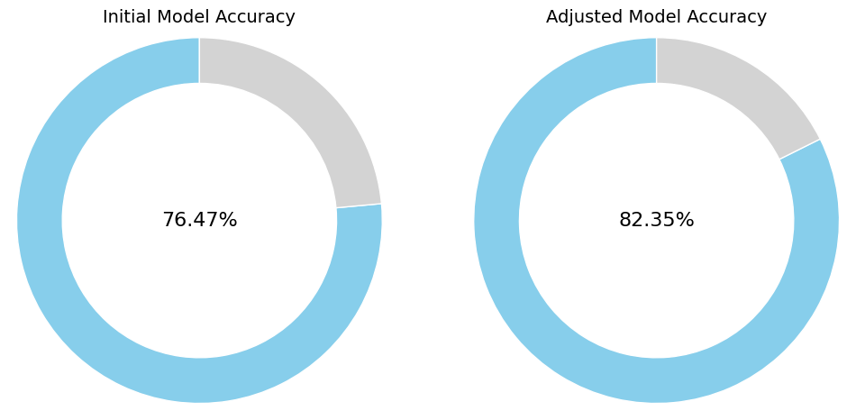
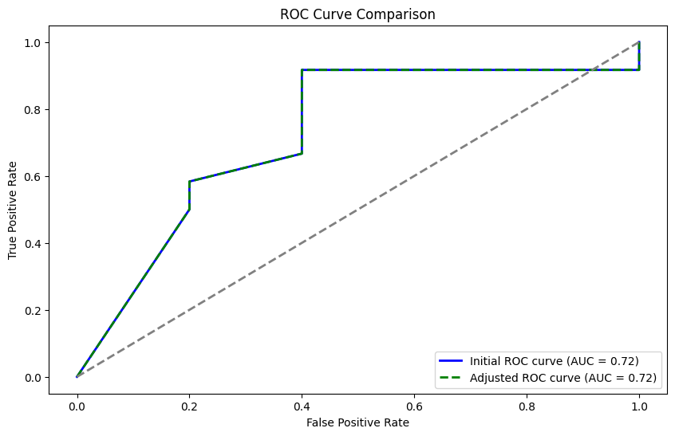

# Auth-Insight
**Auth-Insight** is a Django-based web application designed to enhance enterprise-level user authentication processes through big data analysis and machine learning. This project is dedicated to addressing common authentication challenges—such as login fatigue, frustration, and overload—by applying advanced data analysis and improving model accuracy through a Random Forest classifier. Auth-Insight incorporates Single Sign-On (SSO), data collection for analysis, and continuous optimization, ultimately aiming to enhance security and user experience for enterprise authentication systems.

## Features

- **Single Sign-On (SSO)**: Streamlines user authentication across multiple organizational services, delivering a seamless login experience.
- **Big Data Integration**: Collects, stores, and analyzes large volumes of user authentication data to generate valuable insights.
- **Random Forest Classification**: Utilizes an optimized Random Forest model to classify user activities, identify anomalies, and improve authentication accuracy by at least 3%.
- **Insights Generation**: Provides actionable insights into common authentication issues, such as login fatigue, overload, and user frustration.
- **Continuous Monitoring**: Includes monitoring mechanisms for ongoing model evaluation, ensuring consistent authentication system optimization and adaptation to emerging security threats.

## Improvements in Model Accuracy
The **Improving Model Accuracy for User Authentication using Random Forest** branch focuses on enhancing the Random Forest model's accuracy, which achieved a significant improvement over initial clustering-based approaches. Key enhancements include:

- **Feature Engineering**: Incorporating new features such as login frequency and unique user-based behavioral attributes to increase model accuracy.
- **Hyperparameter Tuning**: Extensive tuning of the Random Forest model’s parameters, resulting in a final model accuracy improvement of over 4%.
- **Threshold Adjustment**: ROC-AUC-based threshold adjustment to improve sensitivity and specificity for critical authentication decisions.


## Random Forest Results

The integration of the optimized Random Forest model significantly improved the performance of user authentication analysis. After extensive data preprocessing, feature engineering, and hyperparameter tuning, the model delivered superior accuracy, recall, and precision metrics. This model effectively identifies successful and unsuccessful authentication attempts, providing enhanced security and user experience.

### Model Performance
- **Accuracy**: 82.35%
- **ROC-AUC Score**: 72.5%
- **Improved Precision**: Particularly effective in identifying successful authentication attempts, making it a valuable addition to enterprise security.





### Discussion
The Random Forest model’s results demonstrate its effectiveness in handling large and complex authentication datasets, providing higher reliability than clustering techniques. The model’s ability to handle categorical and numerical data simultaneously enhances its accuracy and sensitivity. Future work will focus on improving performance for unsuccessful login attempts and exploring alternative models to further optimize accuracy and robustness.

## Installation

To set up the application locally:

1. **Clone the Repository**:
    ```bash
    git clone https://github.com/Nathius262/auth-insight.git
    cd auth-insight
    ```

2. **Install Dependencies**:
    ```bash
    pip install -r requirements.txt
    ```

3. **Apply Migrations**:
    ```bash
    python manage.py migrate
    ```

4. **Run the Server**:
    ```bash
    python manage.py runserver
    ```

## Branch Details

For improvements specific to this project, please refer to the **Improving-Model-Accuracy-for-User-Authentication-using-Random-Forest** branch.

## Contributing

Contributions are welcome! Please fork the repository, create a new branch, and submit a pull request with your proposed changes.

## License

This project is licensed under the MIT License.

## References

- **Stephan Wiefling, Paul René Jørgensen, Sigurd Thunem, and Luigi Lo Iacono**: *Pump Up Password Security! Evaluating and Enhancing Risk-Based Authentication on a Real-World Large-Scale Online Service*. In: ACM Transactions on Privacy and Security (2022). DOI: [10.1145/3546069](https://doi.org/10.1145/3546069)
- **Risk-Based Authentication (RBA)**: [https://riskbasedauthentication.org](https://riskbasedauthentication.org)
- **Freeman et al. (2016)**: *Evaluating Risk-Based Authentication* [10.14722/ndss.2016.23240](https://doi.org/10.14722/ndss.2016.23240)

